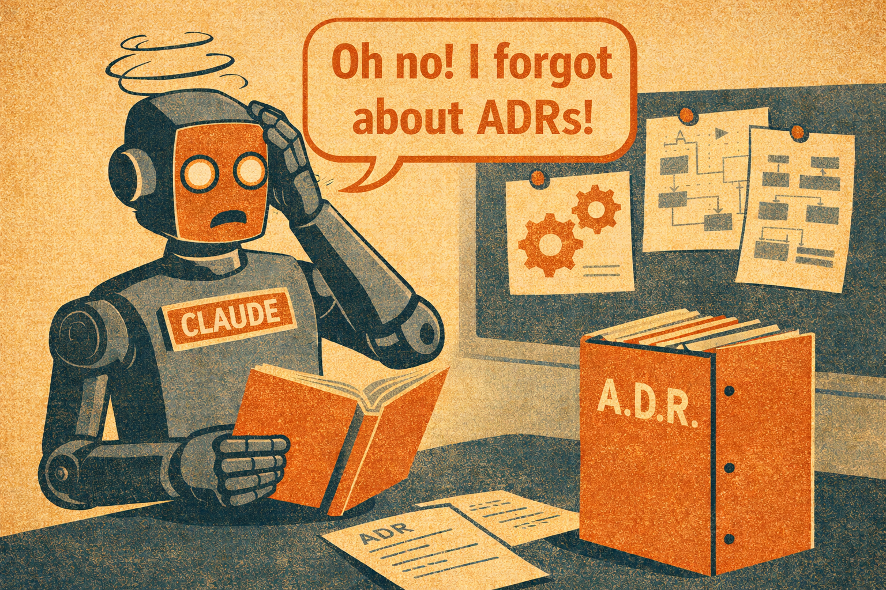

# ADR in the AI Epoch

In his article ([Architecture Decision Records](https://martinfowler.com/bliki/ArchitectureDecisionRecord.html)), Martin Fowler highlights the significance of Architecture Decision Records (ADRs) in providing historical knowledge for team newcomers.

I have titled this article "ADR in the AI Epoch" because nowadays, it is not just humans on the team, but there are also several AI agents involved in the process.

## The Problem

Recently in one of my projects, I encountered a situation where Claude Code seemed to have forgotten about all the decisions that had already been well-documented in the ADR. This oversight led to breaking everything that had been completed the previous day. Expected, right?

## The Solution

The solution is to inform Claude Code about when he should use ADRs and how to do so. Please let him know that adding ADRs during the planning phase is mandatory (see [instructions](./docs/AGENTS.md)), and advise him to review this information.

## Benefits/Results

This will not only save time but also tokens.

## Conclusion

I have shared the [template for the ADRs](./docs/adr/ADR-TEMPLATE.md) and the [instructions for Claude Code](./docs/AGENTS.md) in the `CLAUDE.md` file, which will assist with Claude's memory between sessions.

---

## Quick Reference

### Useful Links
- [Architecture Decision Records by Martin Fowler](https://martinfowler.com/bliki/ArchitectureDecisionRecord.html)
