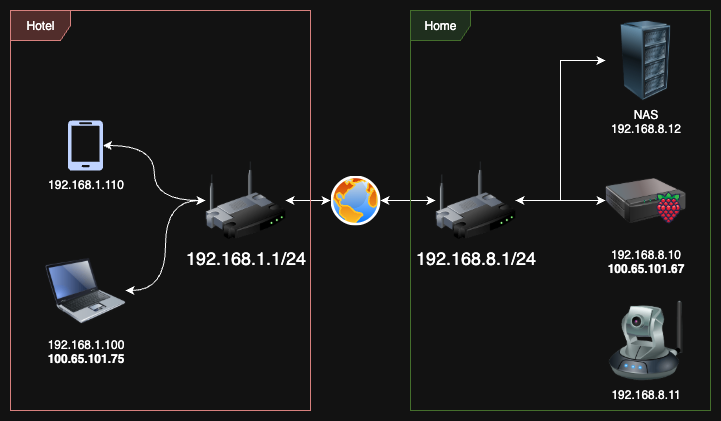

# Mesh VPN for Raspberry Pi :: Part 2



In a previous article, we completed the configuration of our Mesh VPN with the Raspberry Pi functioning on the IP addresses 192.168.8.10 and 100.65.101.67 under the provider NAT. This host is now accessible via the Tailscale Mesh VPN globally, as shown in the picture below.

If you haven't read Part 1, check it out [here](../mesh-vpn-raspberry-pi/README.md) - it covers the basic Tailscale setup.

## The Problem: Accessing Your Home Network Devices

I have added a few extra components to my diagram to illustrate the next steps for you - an IP camera and a NAS. Additionally, I have included another router on the opposite side of the globe. Please note that both routers have different subset IP addresses, 192.168.1.1/24 and 192.168.8.1/24. This detail is crucial, as I mentioned in the previous section of this article.

I would also like to note that the Tailscale client will be installed ONLY on one device within your home network.

## The Solution: Subnet Routing

### Step 1: Configure IP Forwarding on the Raspberry Pi

```bash
echo 'net.ipv4.ip_forward = 1' | sudo tee -a /etc/sysctl.conf
echo 'net.ipv6.conf.all.forwarding = 1' | sudo tee -a /etc/sysctl.conf
sudo sysctl -p /etc/sysctl.conf
```

### Step 2: Add Subnet Advertising

```bash
sudo tailscale up --advertise-routes=192.168.8.0/24
```

### Step 3: Approve Advertisement in Tailscale Admin Console

The final step is to approve this advertisement on the Tailscale admin console: https://login.tailscale.com/admin/machines

You can also test the routes from the Raspberry Pi terminal:

```bash
tailscale status
```

## Testing the Setup

Now everything is ready for the next step! Please go to your laptop that is connected to the "Hotel" network, launch the Tailscale client (if you haven't already), and type the following command in the terminal:

```bash
ping 192.168.8.12
```

You can access the ping log of your NAS from anywhere in the world using the SAME IP address that you used at home. Pretty convenient, isn't it?

## Network Topology Planning


This approach will only work if you have different subnets set up for your "Home" and "Hotel". Since admins worldwide often use 192.168.0.0/24 and 192.168.1.0/24, I would not recommend using them for your home LAN. Furthermore, if you plan on setting up different locations with the Tailscale mesh, such as Home, Office, etc., I recommend planning the LAN topology in advance with different subnets. This way, you'll have the ability to easily access your devices from anywhere in the world.

## Benefits/Results

- **Global device access** - Reach any device on your home network from anywhere
- **No port forwarding** - No need to configure router port forwarding
- **Secure connectivity** - All traffic encrypted through Tailscale mesh
- **Multiple location support** - Easy expansion to office, vacation homes, etc.
- **Simplified management** - One Tailscale client per network location

## Conclusion

With subnet routing configured, your Raspberry Pi now acts as a gateway to your entire home network. This powerful feature transforms how you access your IoT devices, NAS, cameras, and other network resources while traveling.

The key to success is proper subnet planning - using unique IP ranges for each location prevents conflicts and ensures seamless connectivity across your global mesh network.

---

## Quick Reference

### Essential Commands
```bash
# Enable IP forwarding
echo 'net.ipv4.ip_forward = 1' | sudo tee -a /etc/sysctl.conf
echo 'net.ipv6.conf.all.forwarding = 1' | sudo tee -a /etc/sysctl.conf
sudo sysctl -p /etc/sysctl.conf

# Advertise subnet routes
sudo tailscale up --advertise-routes=192.168.8.0/24

# Check status
tailscale status

# Test connectivity
ping 192.168.8.12
```

### Useful Links
- [Tailscale Admin Console](https://login.tailscale.com/admin/machines)
- [Part 1 of this series](../mesh-vpn-raspberry-pi/README.md)
- [Tailscale Subnet Routing Documentation](https://tailscale.com/kb/1019/subnets/)

---

*Happy working with your microboards! 🥧*