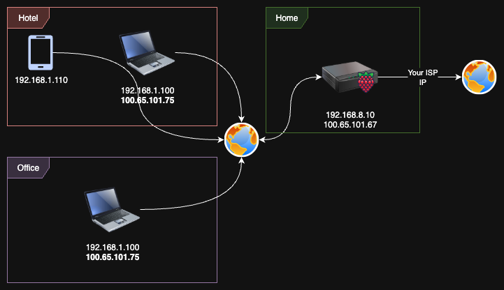

# Mesh VPN for Raspberry Pi :: Part 3 - Exit Nodes



In the previous parts of this series, we configured basic Tailscale mesh networking and subnet routing. Now we'll explore one of Tailscale's most powerful features: exit nodes. This allows you to route all your internet traffic through a specific device in your mesh network, effectively changing your public IP address and geographic location.

If you haven't read the previous parts, check them out first:
- [Part 1: Basic Tailscale Setup](../mesh-vpn-raspberry-pi/README.md)
- [Part 2: Subnet Routing](../mesh-vpn-raspberry-pi-part2/README.md)

## The Problem: Geographic IP Restrictions

Imagine you're traveling abroad and need to access services that are only available from your home country. Or perhaps you're working from a coffee shop and want to route your traffic through your secure home network. Maybe you need to access region-locked content or ensure your traffic appears to come from a specific geographic location.

Traditional VPN services solve this problem, but they often:
- Cost money for quality service
- Have limited server locations
- May log your traffic
- Require trust in third-party providers
- Can be blocked by some services

## The Solution: Tailscale Exit Nodes

With Tailscale exit nodes, you can use any device in your mesh network as a gateway to the internet. Your Raspberry Pi at home can become your personal VPN server, routing all your traffic through your home internet connection.

### Step 1: Configure Your Raspberry Pi as Exit Node

First, enable IP forwarding (if not already done from Part 2):

```bash
echo 'net.ipv4.ip_forward = 1' | sudo tee -a /etc/sysctl.conf
echo 'net.ipv6.conf.all.forwarding = 1' | sudo tee -a /etc/sysctl.conf
sudo sysctl -p /etc/sysctl.conf
```

Then advertise your Raspberry Pi as an exit node:

```bash
sudo tailscale up --advertise-exit-node
```

### Step 2: Approve Exit Node in Admin Console

Go to the Tailscale admin console: https://login.tailscale.com/admin/machines

Find your Raspberry Pi and enable the "Exit node" feature. This allows other devices in your mesh to route traffic through this device.

### Step 3: Configure Client to Use Exit Node

On your laptop or mobile device, configure it to use the exit node:

```bash
# Route all traffic through the exit node
tailscale up --exit-node=raspberry-pi-hostname

# Or use the Tailscale IP directly
tailscale up --exit-node=100.65.101.67
```

You can also enable this through the Tailscale GUI on desktop or mobile applications.

### Step 4: Verify Your New Public IP

Check that your traffic is now routing through your home connection:

```bash
curl ifconfig.me
```

This should now show your home IP address instead of your current location's IP.


---

## Quick Reference

### Essential Commands
```bash
# Configure exit node
sudo tailscale up --advertise-exit-node

# Use exit node
tailscale up --exit-node=node-name

# Disable exit node
tailscale up --exit-node=""

# Check status
tailscale status
curl ifconfig.me

# Enable IP forwarding
echo 'net.ipv4.ip_forward = 1' | sudo tee -a /etc/sysctl.conf
sudo sysctl -p /etc/sysctl.conf
```

### Useful Links
- [Tailscale Admin Console](https://login.tailscale.com/admin/machines)
- [Exit Nodes Documentation](https://tailscale.com/kb/1103/exit-nodes/)
- [Part 1: Basic Setup](../mesh-vpn-raspberry-pi/README.md)
- [Part 2: Subnet Routing](../mesh-vpn-raspberry-pi-part2/README.md)