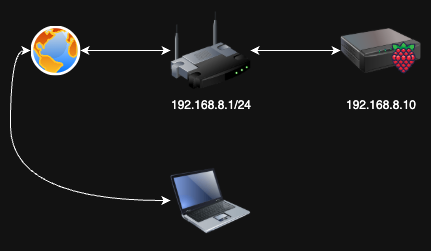
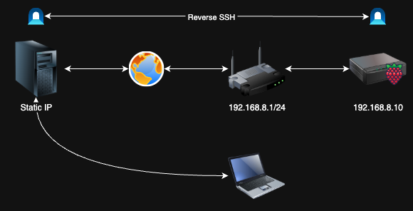
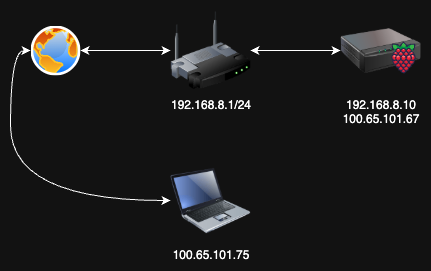

# Mesh VPN for Raspberry Pi



If you are fond of microboards like I am, this article will surely be of interest to you. Today, I will share some information about things that are readily available to you.

Before we begin, I would like to mention that I personally prefer using Linux on my microboard, typically Ubuntu. When I refer to a "microboard," I am not only talking about the Raspberry Pi but also other alternatives like Orange Pi.

## The Problem: Accessing Your Raspberry Pi Remotely

Imagine that you have a router (192.168.8.1) and a Raspberry Pi (192.168.8.10) connected to the local area network in your apartment. How can you connect to the Raspberry Pi? You can try to do it with SSH, I believe. But what should you do if your provider uses a "grey" IP with a series of NATs? It might be impossible, or at least you would need to use something like reverse SSH.



Yes, reverse SSH is a good idea, with only one drawback - you would need an additional host with a static IP, as shown in the illustration above.

## The Solution: Mesh VPN with Tailscale

Now I will show you how to do it without any additional components, using only your Raspberry Pi and laptop. We will use a mesh VPN for this case. I intentionally chose to use `192.168.8.0/24` instead of the commonly used `192.168.1.0/24`. This choice will benefit us greatly in the future as we expand our mesh network.

### Step 1: Install Tailscale on Raspberry Pi

Please log in to your Raspberry Pi first (before leaving your home) and then proceed with installing Tailscale:

```bash
sudo apt update
sudo apt install tailscale
```

### Step 2: Launch Tailscale

Afterward, you can launch Tailscale on your Raspberry Pi host:

```bash
sudo tailscale up
```

You will be provided with a link where you will need to authorize first. I recommend using a separate Gmail account for this purpose. This authorization process will need to be used on all hosts on which you are planning to use mesh VPN.

### Step 3: Setup on Your Laptop

Please repeat this process on your laptop as well. The steps may vary depending on the operating system you are using, so if you encounter any difficulties, please refer to the [Tailscale documentation](https://tailscale.com/kb/).

## Result: Seamless Mesh Network



If you have done everything correctly, you will see additional IPs assigned to each of your hosts, which will be part of the mesh VPN. This will allow you to easily reach each host on this network.

In the diagram above, you can see how each device gets a Tailscale IP (100.x.x.x range) in addition to its local network IP. The Raspberry Pi now has both `192.168.8.10` (local) and `100.65.101.67` (Tailscale), while the laptop has `100.65.101.75`.

## Benefits of This Approach

- **No additional infrastructure** - No need for a VPS or static IP server
- **Zero configuration port forwarding** - Tailscale handles NAT traversal automatically  
- **Secure by default** - All traffic is encrypted end-to-end
- **Easy to scale** - Add more devices to your mesh network easily
- **Cross-platform** - Works on Linux, Windows, macOS, iOS, Android

## Conclusion

Isn't it amazing? From now on, you can easily access your Raspberry Pi from your laptop and vice versa, regardless of your network configuration or ISP limitations.

This setup opens up exciting possibilities for:
- Remote development on your Raspberry Pi
- Home automation access from anywhere
- IoT project monitoring and debugging
- Creating a personal cloud infrastructure

## What's Next?

I will explain how simple it is to access your home infrastructure from anywhere in the world with some advance preparation:

---

## Quick Reference

### Installation Commands
```bash
# On Raspberry Pi (Ubuntu/Debian)
sudo apt update
sudo apt install tailscale
sudo tailscale up

# Follow the authorization link provided
# Repeat on other devices
```

### Useful Commands
```bash
# Check Tailscale status
tailscale status

# Show current IP addresses
tailscale ip

# Check connection to specific node
tailscale ping [node-name]
```

---

*Happy working with your microboards! 🥧*