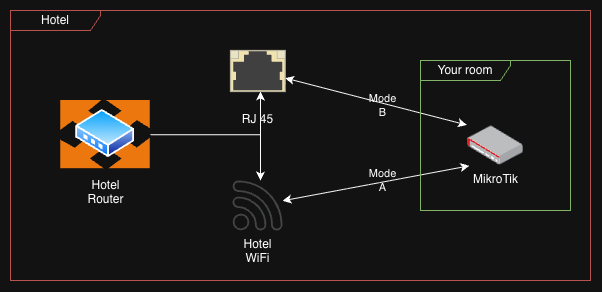

# MikroTik as a Travel Router



This time, I suggest shifting from AI to real-life and real-world use cases that can assist you in streamlining your daily life. In this article, I aim to explain how you can utilize the MikroTik router as a travel router to enhance the safety and comfort of your stay in locations such as hotels, cafes, or other public areas.

## The Problem

Let me explain the situations in which you might find it useful:
1. When you need to separate your devices from the hotel network to protect them against potential attacks.
2. When you are experiencing weak WiFi signals in your hotel room. For instance, it may work close to the door or window, but not effectively enough for comfortable use.

## The Solution

The main idea is to have a "Travel Router" that can function as a repeater for the hotel WiFi or connect directly to the hotel's LAN, making it easier for your devices to be connected only to your trusted and preconfigured WiFi network.

Yes, I understand that we have different brands on the market that offer ready-made solutions, including VPN support and even battery backup. However, if you have the required skills and equipment, you can save $100 by choosing a do-it-yourself approach with a MikroTik device.

So, I'll provide you with the full instructions on how to do it step by step. And at the end you'll have two scripts presented on your MikroTik board, which can help you quickly switch from one scenario to another:

- Mode A - WiFi repeater
- Mode B - direct LAN connection to RJ45

Let's do it!

- [Setup Guide](./SETUP-GUIDE.en.md)
- [Hotel Connection Guide](./HOTEL-CONNECT.en.md)

---

## Quick Reference

### Essential Commands

```bash
# Scan for available hotel WiFi networks
/interface/wireless/scan wlan1 duration=5

# Switch to hotel WiFi (WPA2)
:global ssid "HOTEL_SSID"
:global password "HOTEL_PASSWORD"
/system/script/run mode-a

# Switch to hotel WiFi (open network)
:global ssid "HOTEL_SSID"
/system/script/run mode-a

# Switch to hotel cable (plug into ETH1 first)
/system/script/run mode-b

# Verify internet connectivity
/ping 8.8.8.8 count=4
```

### Useful Links

- [Setup Guide](./SETUP-GUIDE.en.md)
- [Hotel Connection Guide](./HOTEL-CONNECT.en.md)
- [MikroTik hAP lite product page](https://mikrotik.com/product/RB941-2nD)
- [RouterOS Wireless Interface documentation](https://help.mikrotik.com/docs/display/ROS/Wireless+Interface)
