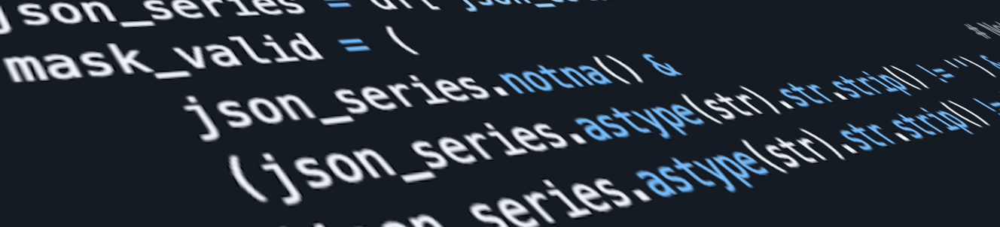
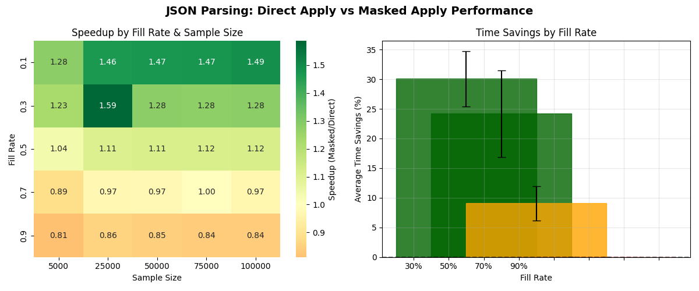

# Pandas: Direct Column Calculation vs Masked One



Recently, one of my colleagues and I had a discussion about two different approaches - determining the optimal way to calculate a column in a Panda's DataFrame based on another column that contains hierarchical JSON.

## The Problem

In short, we have a dataset that includes a column with JSON data, and we need to iterate through all the rows, locate this JSON, parse it, and then somehow calculate the value for a new column.

Since we are unsure in advance of how many rows in this DataFrame will contain valid JSON and how many will be empty, I have suggested the following approach. The first step involves creating a Series with a mask containing only the non-empty rows. In the next step, the target column will be calculated only for the masked series of the JSON values.

Instead, my colleague proposed using direct calculations for all column values. In his opinion, it wouldn't make sense to run a check on each row to verify if it is empty or not during the 1st phase.

I have decided to create a quick benchmark to verify who was correct. The answer that emerged is more complex, and it is worth writing this article.

## The Solution

### Approach 1: Direct Apply

So, the direct approach will be looks like this one, in the simplest case:

```python
def approach_1_direct_apply(self, df: pd.DataFrame) -> tuple:
    """
    APPROACH 1: Direct apply to entire series (processes all rows including nulls)
    """
    start_time = time.time()
    result = df['json_column'].apply(self.parse_json_safe)
    end_time = time.time()
    
    return result, end_time - start_time
```

### Approach 2: Masked Apply

And the approach with the mask will be as the following:

```python
def approach_2_masked_apply(self, df: pd.DataFrame) -> tuple:
    """
    APPROACH 2: Masked Apply - your approach with proper mask_valid filtering
    Uses comprehensive validation: not null, not empty, not whitespace-only
    """
    start_time = time.time()
    
    # Create comprehensive mask for valid JSON strings (exactly like your example)
    json_series = df['json_column']
    mask_valid = (
        json_series.notna() &                           # Not None/NaN
        (json_series.astype(str).str.strip() != '') &   # Not empty after strip
        (json_series.astype(str).str.strip() != 'nan')  # Not string 'nan'
    )
    
    # Initialize result series with None values
    result = pd.Series(None, index=df.index, dtype='object')
    
    # Early return if no valid data (this is the key optimization!)
    if not mask_valid.any():
        end_time = time.time()
        return result, end_time - start_time
    
    # Extract valid series and apply parsing ONLY to valid entries
    valid_series = json_series[mask_valid]
    parsed_values = valid_series.apply(self.parse_json_safe)
    
    # Assign parsed values back to result
    result.loc[mask_valid] = parsed_values
    
    end_time = time.time()
    return result, end_time - start_time
```

## Results

I hope that result will be interesting to you:



As you can see, the actual performance will depend on the size of the DataFrame, the fill rate of the non-empty cells with JSON, and the complexity of the operation needed for each cell. In our scenario, the JSON parsing operation is resource-intensive, whereas checking if a cell is empty is a less resource-demanding operation. Therefore, even with a dataset containing 50,000 rows, we can expect to have consistent performance overall.

But, if you have a small DataFrame with a fill rate higher than 70%, there is no need to make your code more complicated.

---

## Quick Reference

### Essential Commands
```python
# Direct approach - simple but processes all rows
result = df['json_column'].apply(parse_json_safe)

# Masked approach - more complex but skips invalid rows
mask_valid = (
    json_series.notna() & 
    (json_series.astype(str).str.strip() != '') & 
    (json_series.astype(str).str.strip() != 'nan')
)
valid_series = json_series[mask_valid]
result = valid_series.apply(parse_json_safe)
```

### Key Findings
- **Masked approach wins**: 44% of test cases
- **Best performance**: 1.49x speedup at 10% fill rate
- **Break-even point**: ~70% fill rate
- **Use masked approach when**: Fill rate ≤ 50% and large datasets
- **Use direct approach when**: Fill rate ≥ 70% or small datasets