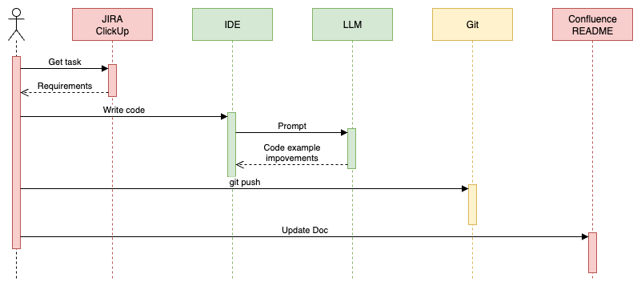

# Seamless AI

Recently, people have come to understand that AI is not a replacement for personnel, but a new tool that has become accessible to everyone.

I have noticed several publications this month that explain the idea that if your organization is experiencing process drawbacks, AI will not help you. Instead, it may only increase your costs.

As for me, we are experiencing a new era of pair programming, but as a partner, we are now more frequently using LLM. That's fantastic since this partner will not get tired and won't need an unexpected coffee break.

## The Problem: Fragmented AI Integration

In this post, I suggest focusing on the software development process as a whole, not just on coding. LinkedIn is saturated with posts comparing different LLM and agents, discussing the benefits of Cursor, and more. Have you considered taking a step back to gain a broader perspective on your daily routine and analyze which parts of it you have completed using the LLM?

If you look at the diagram below, you'll probably be surprised by how small a part of your daily job has actually been improved. What about requirement investigation? I observed an unsuccessful attempt by a product owner and business analysts to begin creating user stories using embedded AI, as an example, within ClickUp. And it's quite challenging - I would certainly need an LLM to explain to me what is happening in this description.

Additionally, what if you need assistance carrying out a task in Git that you've forgotten how to do? Soon, you may find yourself frequently copying text from JIRA to your Copilot and then from your Copilot to the terminal.

## The Solution: Process-Wide Integration

It appears that we are in the initial stages of integrating AI into our processes. The future belongs to those who can effectively organize the entire process, rather than just offering one isolated technological tool to the Stone Age process.

## Conclusion

The current state of AI integration in software development processes reveals significant gaps between tools and workflows. True transformation requires a holistic approach that encompasses the entire development lifecycle, from requirements gathering to documentation updates.

---

## Quick Reference

### Key Insights
- AI integration is currently fragmented across development tools
- Most productivity gains focus only on coding, not the complete process
- Manual context switching between tools reduces AI effectiveness
- Future success depends on seamless process integration

### Common Integration Challenges
- Requirements analysis remains largely manual
- Context loss when moving between JIRA, IDE, and terminal
- Isolated AI tools create workflow inefficiencies
- Documentation updates lag behind development progress

### Useful Links
- [AI in Software Development Best Practices](https://docs.github.com/en/copilot)
- [Process Optimization Strategies](https://martinfowler.com/articles/developer-effectiveness.html)